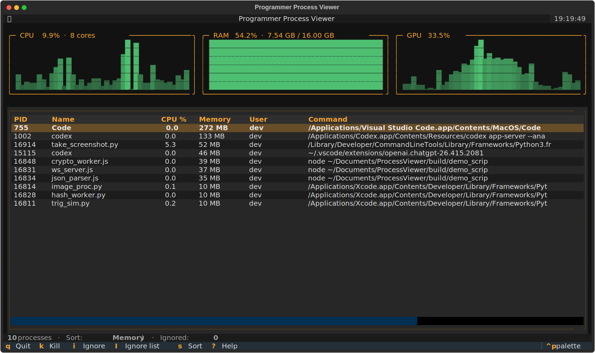

# Programmer Process Viewer

A focused, live TUI for the processes that actually matter when you're writing code — Python interpreters, Node runtimes, compilers, language servers, dev servers, your editor, your AI coding CLI. Everything else stays out of the way.



## Why

`top` and `htop` drown you in system noise. Activity Monitor hides the command line. This shows only what a programmer cares about, updates once a second, and lets you terminate or permanently ignore processes from the keyboard.

## Features

- **CPU, RAM, and GPU panels** with 60-second sparkline history (GPU is read from macOS `ioreg` — no sudo, no kexts).
- **Programmer-focused filter**: Python, Node, Go, Rust, Ruby, Java, PHP, compilers (clang/gcc/make/cmake), build tools, language servers, and editor processes (VS Code, Codex, Claude Code) are shown by default. Chrome is hidden unless you ask for it.
- **Friendly process names**: when a process is a bare interpreter (`python3`, `node`, …) the Name column shows the script filename (`train_model.py`, `dev_server.js`) instead of `Python`.
- **Live actions**: terminate (SIGTERM) / force kill (SIGKILL) the selected process, cycle sort column, or add processes to a persistent ignore list.
- **Persistent ignore list** stored at `~/.config/programmer-process-viewer/ignore.json`, manageable from inside the app.

## Install

### From the installer (recommended)

Download `Programmer Process Viewer.dmg` from the [latest release](../../releases/latest), open it, and drag the app to Applications. First launch: right-click → Open (unsigned app — macOS Gatekeeper will warn once).

The `.app` opens a Terminal window and runs the TUI there, so it has a real tty.

### From source

```bash
git clone <this repo>
cd ProcessViewer
python3 -m venv .venv
.venv/bin/pip install -r requirements.txt
.venv/bin/python process_viewer.py
```

Requires Python 3.10+, macOS (the GPU probe and the `.app` launcher are macOS-specific; the TUI itself runs fine on Linux with `get_gpu_utilization()` returning `None`).

## Usage

```
ppv [--chrome] [--include NAME ...] [--exclude SUBSTR ...]
```

| Flag | Meaning |
|---|---|
| `--chrome` | Also show Chrome / Chromium processes |
| `--include foo bar` | Extra process names to include (exact, lowercase) |
| `--exclude baz` | Substrings to hide (matches both exe name and cmdline) |

### Keybindings

| Key | Action |
|---|---|
| `↑` / `↓` / `PgUp` / `PgDn` | Move selection |
| `k` | Terminate selected process (SIGTERM) |
| `K` | Force kill selected (SIGKILL) |
| `i` | Add selected process name to ignore list |
| `shift+I` | Open the ignore-list manager |
| `s` | Cycle sort column (CPU → Memory → Name → PID) |
| `r` | Refresh now |
| `?` | Help |
| `q` | Quit |

## Build your own installer

```bash
python3 -m venv .venv
.venv/bin/pip install -r requirements.txt pyinstaller Pillow
./build.sh
```

Produces `dist/Programmer Process Viewer.app` and `dist/Programmer Process Viewer.dmg`.

## Tests

```bash
./test.sh
```

Covers unit logic (filter, config, formatting), fuzz-style invariants, and Textual pilot-driven UI behavior.

## Marketing screenshot

`marketing_screenshot.svg` is regenerated headlessly by [`take_screenshot.py`](take_screenshot.py): it spawns a `ProcessViewer` inside Textual's pilot harness, fills 60 seconds of sparkline history, renders a mock GPU trace, and auto-redacts the current user's home path and login name so the asset is shareable.

## License

MIT.
